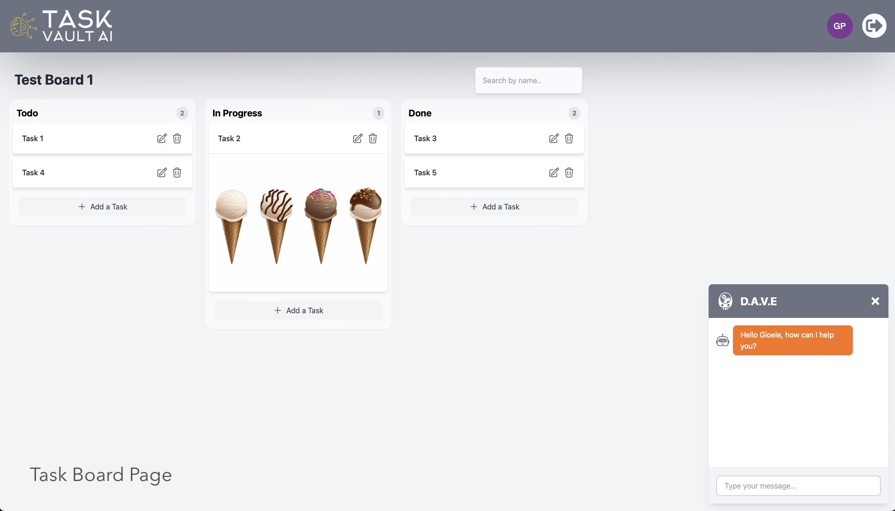

# Task Vault AI 

[](https://nodejs.org/) [](https://expressjs.com/) [](https://reactjs.org/) [](https://nextjs.org/) [](https://www.typescriptlang.org/) [](https://github.com/pmndrs/zustand) [](https://tailwindcss.com/) [](https://openai.com/)

Task Vault AI is a powerful project management and collaboration web application with an AI-Powered Chatbot to showcase task automation and process enhancement. This project is built using a combination of modern technologies and frameworks.



## Features

- **User Authentication**: Users can register and log in to the application securely.
- **Project Management**: Authenticated users can create, edit, delete, and view their projects or shared projects.
- **Workspace Management**: Users can manage workspaces within projects, such as adding or removing collaborators and selecting specific workspaces.
- **Task Boards**: Each workspace can have its own task board, utilizing a Kanban-style interface for task management.
- **AI-Powered Chatbot**: The built-in chatbot can explain features, automate certain tasks, and provide project and task summaries.
- **Secure**: User passwords are hashed with bcrypt for security, and sensitive keys are stored securely in environment variables.

## Installation

1. Clone the repository:

   ```bash
   git clone https://github.com/yourusername/task-vault-ai.git
   ```
   
2. Install dependencies:

   ```bash
   cd task-vault-ai
   npm install
   ```
   
3. Set up your environment variables by creating a .env.local file and adding your OpenAI API key:

   ```env
   OPENAI_API_KEY = your_api_key_here
   ```
   
4. Start the application:

   ```bash
   npm run dev
   ```
   
5. Access the application in your web browser at http://localhost:3000.

## Usage

1. Register and log in to the application.
2. Create new projects or explore shared ones.
3. Manage workspaces within your projects and collaborate with others.
4. Utilize the AI chatbot to automate tasks and get project/task summaries.

## Acknowledgments

- [OpenAI](https://openai.com) for their AI services.
- [React Beautiful DND](https://github.com/atlassian/react-beautiful-dnd) for the Kanban board functionality.
- [Zustand](https://github.com/pmndrs/zustand) - A small, fast, and scaleable state management library.
- [Headless UI](https://headlessui.dev/) - A set of unstyled, fully accessible UI components.
- [Axios](https://github.com/axios/axios) - A promise-based HTTP client for making HTTP requests.
- [Bcrypt](https://github.com/kelektiv/node.bcrypt.js) - A library for hashing passwords.
- [Formik](https://formik.org/) - A library for building forms in React.
- [Multer](https://github.com/expressjs/multer) - A middleware for handling file uploads.
- [SQLite](https://www.sqlite.org/) - A C-language library for managing an SQL database.
- Other open-source libraries and frameworks used in this project.

## Contact

If you have any questions or suggestions, feel free to contact me at gioeleprete@gmail.com
